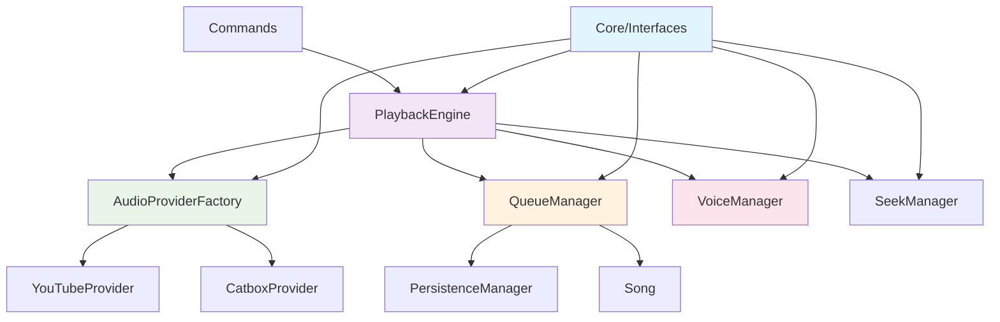

# Odysseia-Similu 音乐机器人架构重构文档

## 概述

本文档描述了 Odysseia-Similu 音乐机器人的全面架构重构，从单一的 `music` 模块重构为模块化、松耦合的现代架构。

## 重构目标

### 1. 架构问题
- **紧耦合**: 所有功能集中在 `music` 模块，组件间依赖复杂
- **单一职责违反**: 单个类承担多种职责
- **可维护性差**: 代码修改影响面大，难以扩展
- **测试困难**: 组件间紧密耦合，难以进行单元测试

### 2. 重构原则
- **单一职责原则 (SRP)**: 每个模块只负责一个明确的业务领域
- **依赖倒置原则 (DIP)**: 使用接口抽象，减少具体实现间的依赖
- **关注点分离 (SoC)**: 将业务逻辑、数据访问和表示层分离
- **领域驱动设计 (DDD)**: 按业务领域而非技术层次组织代码

## 新架构设计

### 模块结构

```
similubot/
├── core/                    # 核心接口和抽象
│   └── interfaces.py        # 定义所有模块间的接口契约
├── provider/                # 音频提供者模块
│   ├── __init__.py
│   ├── base.py             # 提供者基类
│   ├── youtube_provider.py # YouTube音频提供者
│   ├── catbox_provider.py  # Catbox音频提供者
│   └── provider_factory.py # 提供者工厂
├── queue/                   # 队列管理模块
│   ├── __init__.py
│   ├── song.py             # 歌曲数据模型
│   ├── queue_manager.py    # 队列管理器
│   └── persistence_manager.py # 持久化管理器
├── playback/               # 播放控制模块
│   ├── __init__.py
│   ├── voice_manager.py    # 语音连接管理
│   ├── seek_manager.py     # 播放定位管理
│   └── playback_engine.py  # 播放引擎
└── music/                  # 原有模块（保持兼容性）
    └── ...                 # 原有文件
```

### 核心接口设计

#### 1. 音频提供者接口 (IAudioProvider)
```python
class IAudioProvider(ABC):
    @abstractmethod
    def is_supported_url(self, url: str) -> bool: ...
    
    @abstractmethod
    async def extract_audio_info(self, url: str) -> Optional[AudioInfo]: ...
    
    @abstractmethod
    async def download_audio(self, url: str, progress_callback: Optional[ProgressCallback] = None) -> Tuple[bool, Optional[AudioInfo], Optional[str]]: ...
```

#### 2. 队列管理器接口 (IQueueManager)
```python
class IQueueManager(ABC):
    @abstractmethod
    async def add_song(self, audio_info: AudioInfo, requester: discord.Member) -> int: ...
    
    @abstractmethod
    async def get_next_song(self) -> Optional[SongInfo]: ...
    
    @abstractmethod
    async def clear_queue(self) -> int: ...
    
    # ... 其他队列操作方法
```

#### 3. 语音管理器接口 (IVoiceManager)
```python
class IVoiceManager(ABC):
    @abstractmethod
    async def connect_to_channel(self, channel: discord.VoiceChannel) -> Tuple[bool, Optional[str]]: ...
    
    @abstractmethod
    async def play_audio(self, guild_id: int, source: discord.AudioSource, after_callback: Optional[Any] = None) -> bool: ...
    
    @abstractmethod
    def is_playing(self, guild_id: int) -> bool: ...
    
    # ... 其他语音控制方法
```

## 模块详细设计

### 1. Core 模块 (`similubot/core/`)

**职责**: 定义系统各模块间的接口契约

**特点**:
- 包含所有接口定义和数据模型
- 不依赖任何具体实现
- 提供依赖倒置的基础

**主要组件**:
- `interfaces.py`: 定义所有模块接口
- `AudioInfo`: 音频信息数据类
- `SongInfo`: 歌曲信息接口

### 2. Provider 模块 (`similubot/provider/`)

**职责**: 处理各种音频源的提取和下载

**特点**:
- 每个提供者专注一种音频源
- 统一的错误处理和日志记录
- 支持进度跟踪和配置管理

**主要组件**:
- `BaseAudioProvider`: 提供者基类，包含通用功能
- `YouTubeProvider`: YouTube视频音频提取
- `CatboxProvider`: Catbox音频文件验证
- `AudioProviderFactory`: 提供者工厂，自动检测URL类型

**设计模式**:
- **工厂模式**: `AudioProviderFactory` 根据URL自动选择合适的提供者
- **模板方法模式**: `BaseAudioProvider` 定义通用流程，子类实现具体逻辑

### 3. Queue 模块 (`similubot/queue/`)

**职责**: 管理音乐队列和持久化

**特点**:
- 线程安全的队列操作
- 完整的持久化支持
- 数据验证和错误恢复

**主要组件**:
- `Song`: 歌曲数据模型，支持序列化和反序列化
- `QueueManager`: 队列管理器，提供所有队列操作
- `PersistenceManager`: 持久化管理器，处理数据存储

**设计模式**:
- **数据访问对象模式**: `PersistenceManager` 封装数据存储逻辑
- **领域模型模式**: `Song` 包含业务逻辑和数据

### 4. Playback 模块 (`similubot/playback/`)

**职责**: 处理音频播放和语音管理

**特点**:
- 统一的播放控制接口
- 支持多服务器并发播放
- 完整的错误处理和状态管理

**主要组件**:
- `VoiceManager`: 管理Discord语音连接
- `SeekManager`: 处理播放位置定位
- `PlaybackEngine`: 播放引擎，协调各组件

**设计模式**:
- **外观模式**: `PlaybackEngine` 为复杂的播放逻辑提供简单接口
- **状态模式**: 管理播放、暂停、停止等状态

## 依赖关系图



## 重构优势

### 1. 可维护性提升
- **模块化**: 每个模块职责清晰，修改影响范围小
- **松耦合**: 模块间通过接口交互，减少依赖
- **单一职责**: 每个类只负责一个明确的功能

### 2. 可扩展性增强
- **新音频源**: 只需实现 `IAudioProvider` 接口
- **新存储方式**: 只需实现 `IPersistenceManager` 接口
- **新播放功能**: 可以独立扩展播放模块

### 3. 可测试性改善
- **单元测试**: 每个模块可以独立测试
- **模拟对象**: 通过接口可以轻松创建模拟对象
- **集成测试**: 模块间的交互可以单独测试

### 4. 代码质量提升
- **类型安全**: 使用类型提示和接口约束
- **错误处理**: 统一的错误处理策略
- **日志记录**: 结构化的日志记录

## 向后兼容性

### 保持兼容的功能
- ✅ 所有现有的音乐命令
- ✅ 队列持久化功能
- ✅ YouTube和Catbox支持
- ✅ 播放控制和定位功能
- ✅ 进度跟踪和错误处理

### 迁移策略
1. **渐进式迁移**: 新架构与原有代码并存
2. **接口适配**: 提供适配器保持API兼容
3. **功能验证**: 确保所有功能正常工作
4. **性能测试**: 验证性能没有退化

## 性能影响

### 优化方面
- **模块加载**: 按需加载，减少启动时间
- **内存使用**: 更好的对象生命周期管理
- **并发处理**: 模块间的独立性提高并发能力

### 潜在开销
- **接口调用**: 增加了一层抽象，但开销很小
- **对象创建**: 更多的小对象，但提高了可维护性

## 测试策略

### 单元测试
- 每个模块独立测试
- 使用模拟对象隔离依赖
- 覆盖核心业务逻辑

### 集成测试
- 测试模块间的交互
- 验证接口契约的正确性
- 测试完整的用户场景

### 性能测试
- 播放延迟测试
- 内存使用监控
- 并发播放测试

## 未来扩展计划

### 短期目标
- [ ] 完善错误处理和日志记录
- [ ] 添加更多音频源支持
- [ ] 优化播放性能

### 长期目标
- [ ] 支持播放列表功能
- [ ] 添加音频效果处理
- [ ] 实现分布式部署支持

## 总结

通过这次全面的架构重构，Odysseia-Similu 音乐机器人从一个紧耦合的单体架构转变为模块化、可扩展的现代架构。新架构不仅保持了所有现有功能，还为未来的功能扩展奠定了坚实的基础。

重构遵循了现代软件工程的最佳实践，提高了代码质量、可维护性和可测试性，为项目的长期发展提供了有力支撑。
